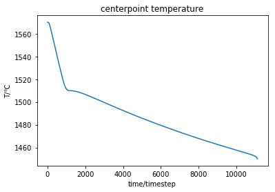

# <center>正方型试件温度场计算</center>

<center>材52 张布雨 2015011958</center>

### 一 实验目的

&nbsp;&nbsp;&nbsp;&nbsp;&nbsp;&nbsp;&nbsp;&nbsp;掌握有限差分法求解传热学方程的基本方法，编程计算正方型试件的温度场。

### 二 模型设计说明

#### 2.1 差分方程的建立

&nbsp;&nbsp;&nbsp;&nbsp;&nbsp;&nbsp;&nbsp;&nbsp;所利用的公式如下
$$
\rho \left( i \right)C\left( i \right)V\left( i \right)\frac{{T\left( {t + \Delta t,i} \right) - T\left( {t,i} \right)}}{{\Delta t}} = \sum\limits_{j = 1}^4 {W\left( {i,j} \right)\left[ {T\left( {t,j} \right) - T\left( {t,i} \right)} \right]}
$$
&nbsp;&nbsp;&nbsp;&nbsp;&nbsp;&nbsp;&nbsp;&nbsp;其中：
$$
W\left( {i,j} \right) = \frac{{S\left( {i,j} \right)}}{{\frac{1}{{h(i,j)}} + \frac{{D(i,j)}}{{K(i)}} + \frac{{D(i,j)}}{{K(i)}}}}
$$

| 变量名        | 含义                       |
| ------------- | -------------------------- |
| ρ(i)          | i单元密度                  |
| C(i)          | i单元比热                  |
| V(i)          | i单元体积                  |
| j             | i单元邻接单元              |
| h(i,j)        | 界面换热系数（热阻的导数） |
| K(i),K(j)     | i，j 单元导热系数 |
| D(i,j),D(j,i) | i，j单元分别到界面的距离 |
| S(i,j)        | i，j单元界面面积 |

代码中的实现：

&nbsp;&nbsp;&nbsp;&nbsp;&nbsp;&nbsp;&nbsp;&nbsp;建立arr与arr1用来记录温度，arr1表示前一时刻的温度。pmetal和pmold分别表示金属和模具的Δt/ρCV。值得注意的是，此为二维计算，所以将其厚度视为1，但实际上，厚度的选择只要一致并对结果并没有影响。

```python
w1 = d_thermo['k']['moldk']  # 模具内部W
w2 = d_thermo['k']['metalk']  # 金属内部W
w3 = pow(gridstep, 1) / (d_thermo['r']['metalmold'] + D / d_thermo['k']['metalk'] + D / d_thermo['k']['moldk'])  # 铸型与金属交界W
w4=0 #边界绝热，故W为零

```

```python
pmetal = timestep / (d_thermo['d']['metald'] * d_thermo['c']['metalc'] * pow(gridstep, 2))
pmold = timestep / (d_thermo['d']['moldd'] * d_thermo['c']['moldc'] * pow(gridstep, 2))
```

```python
#arr为记录温度的数组
if i == 0 or j == 0 or i == (d_len['moldsize'] + 1) or j == (d_len['moldsize'] + 1):
    arr[i][j] = T1
elif i == 1 and j == 1:
    p2 = w1 * (up - arr1[i][j]) + w4 * (down - arr1[i][j]) + w4 * (left - arr1[i][j]) + w1 * (right - arr1[i][j])
    arr[i][j] = pmold * p2 + arr1[i][j]
```


#### 2.2 稳定性条件确定

&nbsp;&nbsp;&nbsp;&nbsp;&nbsp;&nbsp;&nbsp;&nbsp;采用一种较为简单的方法处理显式差分方程的稳定性条件，即保证系数为正即可使显式差分方程获得绝对稳定。但应注意的是，此种稳定为过稳定。

&nbsp;&nbsp;&nbsp;&nbsp;&nbsp;&nbsp;&nbsp;&nbsp;不同单元有着不同的临界时间步长，但是根据公式可以很容易的判断出，最小临界时间步长应对应于内结点。

​        二维内部节点：
$$
F_0\le1/4
$$
​        也即是：
$$
\Delta t\le \frac{\rho C V }{4 W}
$$
​        所以只需进行计算金属内部以及铸型内部的临界时间步长，比较即可得到稳定性条件。

对应代码：

```python
# 计算时间步长（只需计算金属内部和铸型内部的时间步长，并取最小值，以确定稳定性条件）
timestep1 = d_thermo['d']['moldd'] * d_thermo['c']['moldc'] * pow(gridstep, 2) / (4 * w1)
timestep2 = d_thermo['d']['metald'] * d_thermo['c']['metalc'] * pow(gridstep, 2) / (4 * w2)
if timestep1 > timestep2:
    timestep = timestep2
else:
    timestep = timestep1
```


#### 2.3 初始条件

​        初始参数对应如下：


对应代码：

```python
#定义几何参数和物性参数
d_size={'metal':5,'mold':9}
d_thermo={
'c':{'metalc':0.16,'moldc':0.27},
'k':{'metalk':0.1,'moldk':0.0025},
'r':{'metalmold':1500},
'd':{'metald':7.5,'moldd':1.6}
}
d_temp={'liq':1510,'sol':1450}
gridstep=0.2       #网格步长
D=gridstep/2
L=65             #潜热
T0=1570          #金属初始温度
T1=20            #铸型初始温度
```

&nbsp;&nbsp;&nbsp;&nbsp;&nbsp;&nbsp;&nbsp;&nbsp;值得注意的是，d_size['mold']在图形界面显示参数时是可以修改的，其他参数我没有设置为可以修改。但是设置修改也比较容易，如下第192行对更改的数据进行了重新读入，如果需要其他参数也进行修改，只需要在此加入重新读入的语句即可（但应当注意，如果是物性参数，网格大小等发生了变化，应当将前面计算的时间步长等重新计算一次）。后面部分arr以及arr1是初始温度场设置。

```python
root.mainloop()               #注意此处关闭窗口后才能够继续后续计算

#改变参数后再次赋值（同样也可以设置能够读取其他参数的变化，在这里只设置了能够改变铸型边长）
d_size['mold']=int(e2.get())
#可在此处加入其它的更改的重新读入
#再次计算网格数目
d_len={'metalsize':int(d_size['metal']/gridstep),'moldsize':int(d_size['mold']/gridstep),'thick':int((d_size['mold']-d_size['metal'])/(2*gridstep))}

#输出网格数
print(d_len['metalsize'])
print(d_len['moldsize'])
print(d_len['thick'])
#重新定义温度数组
arr = np.zeros((int(d_len['moldsize'] + 2), int(d_len['moldsize'] + 2)), dtype=np.float)
for i in range(d_len['moldsize'] + 2):
    for j in range(d_len['moldsize'] + 2):
        if i > (d_len['thick']) and i < (d_len['thick'] + d_len['metalsize'] + 1) and j > (d_len['thick']) and j < (
                d_len['thick'] + d_len['metalsize'] + 1):
            arr[i][j] = T0
        else:
            arr[i][j] = T1
# 复制arr，表示前一时刻温度
arr1 = arr.copy()
```

&nbsp;&nbsp;&nbsp;&nbsp;&nbsp;&nbsp;&nbsp;&nbsp;铸型的边长对于计算结果是有影响的，因为边长过小会使得边界处与初始温度相差太大，从而不满足边界绝热条件。这一点会在后续讨论。


#### 2.4 边界条件确定

&nbsp;&nbsp;&nbsp;&nbsp;&nbsp;&nbsp;&nbsp;&nbsp;在计算中采用了边界绝热条件，即铸型外侧的绝热层一直保持初始温度20℃。但这要求计算结果铸型最外侧的温度与20℃相差较小。

&nbsp;&nbsp;&nbsp;&nbsp;&nbsp;&nbsp;&nbsp;&nbsp;然而用题目所给的铸型边长进行计算，结果铸型最外层的最高温度达到了683.89℃，远高于20℃。说明此种条件下，绝热假设是不合理的。此种情况下计算得到的金属中心达到固相线的时间为1333.1s。改变铸型的边长多次进行计算，可以发现，当铸型边长为25cm，即厚度达到10cm时，铸型最外层的最高温度为23.3℃，与20℃较为接近，此时计算得到的金属中心达到固相线的时间为1212.0s。


#### 2.5 潜热处理

​        在金属凝固的过程中，会不断的释放结晶潜热。此次计算中，采用等价比热法进行潜热处理。

​        等价比热法的基本思想如下：

​        假设单位体积、单位时间，因潜热放出的发热量为$\rho L\frac{{\partial {f_s}}}{{\partial \tau }}\ $,

​        此时的传热方程如下：
$$
\rho C\frac{{\partial T}}{{\partial \tau }} = \frac{\partial }{{\partial X}}\left( {\lambda \frac{{\partial T}}{{\partial X}}} \right) + \frac{\partial }{{\partial Y}}\left( {\lambda \frac{{\partial T}}{{\partial Y}}} \right) + \frac{\partial }{{\partial Z}}\left( {\lambda \frac{{\partial T}}{{\partial Z}}} \right) + \rho L\frac{{\partial {f_s}}}{{\partial \tau }}\
$$
​        将$ \rho L\frac{{\partial {f_s}}}{{\partial \tau }}\ = \rho L\frac{{\partial {f_s}}}{{\partial T }}\ \frac{{\partial {T}}}{{\partial \tau }}\ $代入传导方程，可以得到：
$$
\rho （C-L\frac{{\partial {f_s}}}{{\partial \tau }}）\frac{{\partial T}}{{\partial \tau }}   = \frac{\partial }{{\partial X}}\left( {\lambda \frac{{\partial T}}{{\partial X}}} \right) + \frac{\partial }{{\partial Y}}\left( {\lambda \frac{{\partial T}}{{\partial Y}}} \right) + \frac{\partial }{{\partial Z}}\left( {\lambda \frac{{\partial T}}{{\partial Z}}} \right)
$$
​        也即是能够得到等价比热：
$$
C_{PE}= C-L\frac{{\partial {f_s}}}{{\partial \tau }}
$$
​        在液相线与固相线温度之间用等价比热置换C，再根据固相率与温度变化的关系，可以将传导方程按非稳定导热问题处理。

​        假定固相率与温度的关系为线性，则可以得到：
$$
C_{PE}= C-L\frac{{\partial {f_s}}}{{\partial \tau }}= C-L\frac{{-1}}{{T_L-T_S }}
$$
对应代码为：

```python
#等价比热
cequal=d_thermo['c']['metalc']-L*(-1/(d_temp['liq']-d_temp['sol']))
```

```python
# 采用等价比热法进行潜热处理
def metal(i, j):
    pe = timestep / (d_thermo['d']['metald'] * cequal * pow(gridstep, 2))
    pmold = timestep / (d_thermo['d']['moldd'] * d_thermo['c']['moldc'] * pow(gridstep, 2))
...
```

```python
#main calculate（中心温度达到固相线前进行循环）
count=0       #用于记录时间
tcenter=[]      #用于记录中心温度
while arr1[int((d_len['moldsize']+1)/2)][int((d_len['moldsize']+1)/2)]>d_temp['sol']:
    for i in range(1,(d_len['moldsize']+1)):
        for j in range(1,(d_len['moldsize']+1)):
            if arr1[i][j]>d_temp['liq'] or arr1[i][j]<d_temp['sol']:    #在液相线之上或者固相线之下，正常的比热
                temp(i,j);
            else:
                metal(i,j);           #在液相线与固相线之间，采用等价比热计算
    count=count+1           #记录运行的步数
    tcenter.append(arr1[int((d_len['moldsize'] + 1) / 2)][int((d_len['moldsize'] + 1) / 2)])
    arr1=arr.copy()        #每运行完一步，将arr的值赋给arr1用作下次计算的初始温度
time[0]=count*timestep
print(time[0])
print(tcenter)           #输出中心温度变化的数组，可以用来绘制冷却曲线
#print(arr)             #此处可以选择输出温度数组
```


### 三 结果讨论

用原始数据进行计算：

参数显示：


输出结果显示：


&nbsp;&nbsp;&nbsp;&nbsp;&nbsp;&nbsp;&nbsp;&nbsp;中心达到固相线的时间为1333.1s，即是22.2min。但可以发现，铸型与绝热层的交界处有着很大的温差，说明此时绝热边界的假设并不成立，所以说计算结果也有着一定的误差。

&nbsp;&nbsp;&nbsp;&nbsp;&nbsp;&nbsp;&nbsp;&nbsp;此种情况下输出中心点温度做出冷却曲线如下：：



&nbsp;&nbsp;&nbsp;&nbsp;&nbsp;&nbsp;&nbsp;&nbsp;可以看出，中心温度开始降低较快，到达固相线后，温度下降速度减慢，直到后面完全凝固，冷却速度有增大的趋势。符合实际所采用的假设。


改变铸型的边长参数再次进行计算：

参数显示：


输出结果显示：


&nbsp;&nbsp;&nbsp;&nbsp;&nbsp;&nbsp;&nbsp;&nbsp;再次计算，中心达到固相线的时间为1212.0s，即是20.2min。此时绝热层与铸型外层的温差很小，最大温差为3.3℃，可以认为绝热假设是合理的。


由上图可以看出，铸型其实选取的有些大，所以又进行了当铸型边长为17cm时的温度场计算。

参数显示：


输出结果为：


&nbsp;&nbsp;&nbsp;&nbsp;&nbsp;&nbsp;&nbsp;&nbsp;可以看出，计算时间为1212.12s，与铸型边长为25cm时的计算结果相差很小，可以认为此时已经基本满足边界绝热条件。此种情况下，铸型与绝热层的温差最大为65.43℃，在可接受的范围内。


### 四 小结

&nbsp;&nbsp;&nbsp;&nbsp;&nbsp;&nbsp;&nbsp;&nbsp;通过本次的温度场计算，我对于传热学有了进一步的了解，并且加深了对于有限差分方法的理解与应用。对于热阻有了进一步理解，对于稳定性条件有了更加客观的认识。

&nbsp;&nbsp;&nbsp;&nbsp;&nbsp;&nbsp;&nbsp;&nbsp;个人认为，除去前后处理，整个代码中最需要注意的是不同节点的划分以及对应公式进行计算。这需要头脑清晰，不然很容易出错。此外，对于题目中所给热阻的正确理解也很重要。还有一点就是python中定义变量时不需要声明类型，所以我将温度以整数输入，也就直接默认了其为整型，导致了记录温度的数组元素也都成了整型，如此计算不出正确结果。

&nbsp;&nbsp;&nbsp;&nbsp;&nbsp;&nbsp;&nbsp;&nbsp;在计算过程中，我遇到了很多的困难，尝试了很多的方法，但最终也算是解决。当初选择python进行编程其实没有考虑太多，只是有些想通过这个机会对这个语言能够有一些了解和熟悉。当然这个小目的也算是实现了，自己从python入门不断的进步，并且初次接触到GUI编程，在一次次的调试中，绝望中又有着几分兴奋，在不断的搜索一些语句使用方法和注意事项时，我感受到了自己能力的不断提高。但不幸的是，我最终也没有思考出一个比较好的实现用户交互的方案，这让我深深的感受到了自己能力的局限性。此外自己的代码写的非常混乱，可读性较差，实现过程也非常的不优美，这些都是自己需要改进的。